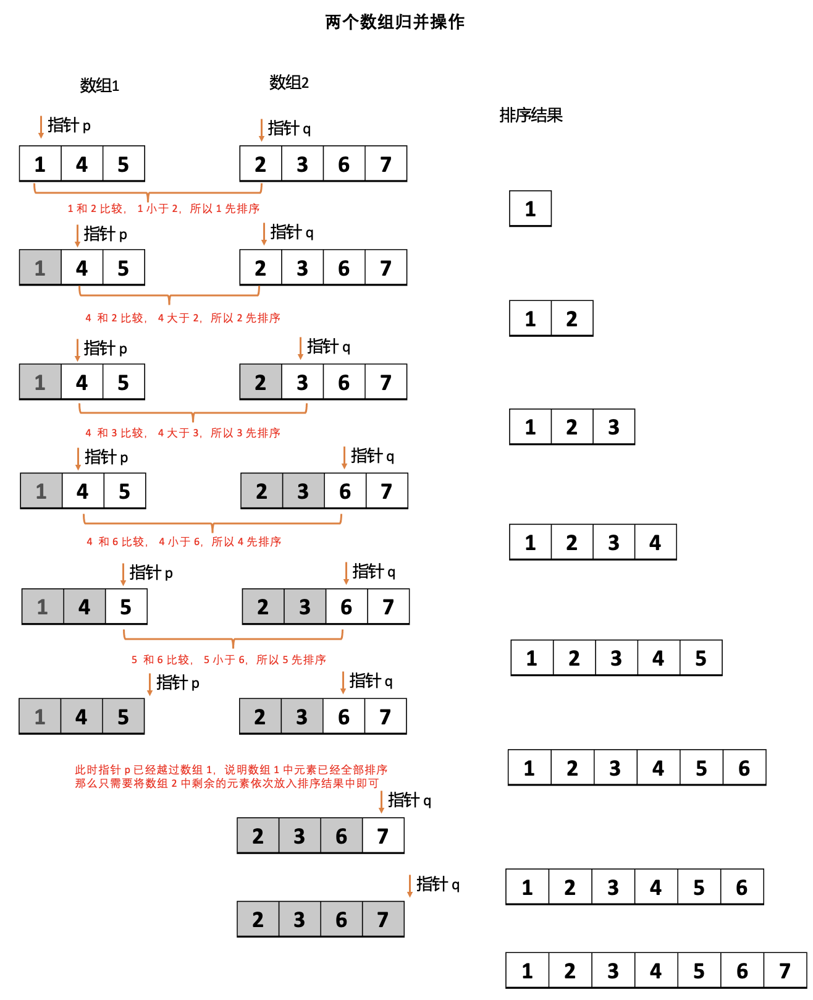

# 归并排序 {#merge-sort}

归并排序能够保证将把任意长度为 N 的数组排序所需时间和 NlogN 成正比。

## 1. 归并 {#merge}

假设有以下两个已排序的数组（升序），请问如何将这两个数组有序地合并在一起（合并后仍然保持升序）。

- 数组 1：`[1, 4, 5]`
- 数组 2：`[2, 3, 6, 7]`

  
  
图1：两个已排序数组归并操作

整个的归并过程

- 步骤 1：定义两个指针 `p 和 q` 分别指向两个数组的起始位置 0，定义一个数组用于存储排序结果
- 步骤 2：比较 `p 和 q` 位置对应的元素大小
  - 如果 `arr1[p] > arr2[q]`，那么将 `q` 位置对应元素放入结果中，并且 `q` 往右移动 1 位（即 `q++`）
  - 否者，将 `p` 位置对应元素放入结果中，并且 `p` 往右移动 1 位（即 `p++`）
- 重复步骤 2，直到其中一个数组中的元素被全部排序成功

  > 在代码中就指针 `p 或 q` 越过各自数组，即 `p > arr1.length - 1 或 q > arr2.length - 1`

- 步骤 3：将另一个未完全排序数组中的剩余元素依次挪到排序结果中
  > 因为数组本身就是已排序的，所以可直接挪动

归并操作，就是将两个有序的数组归并成一个更大的有序数组。归并排序就是在这个基础上发明。

## 2. 归并排序

要将一个数组排序，可以先（递归地）将数组分成两半排序，然后将结果归并起来。
整体的思路如下：
