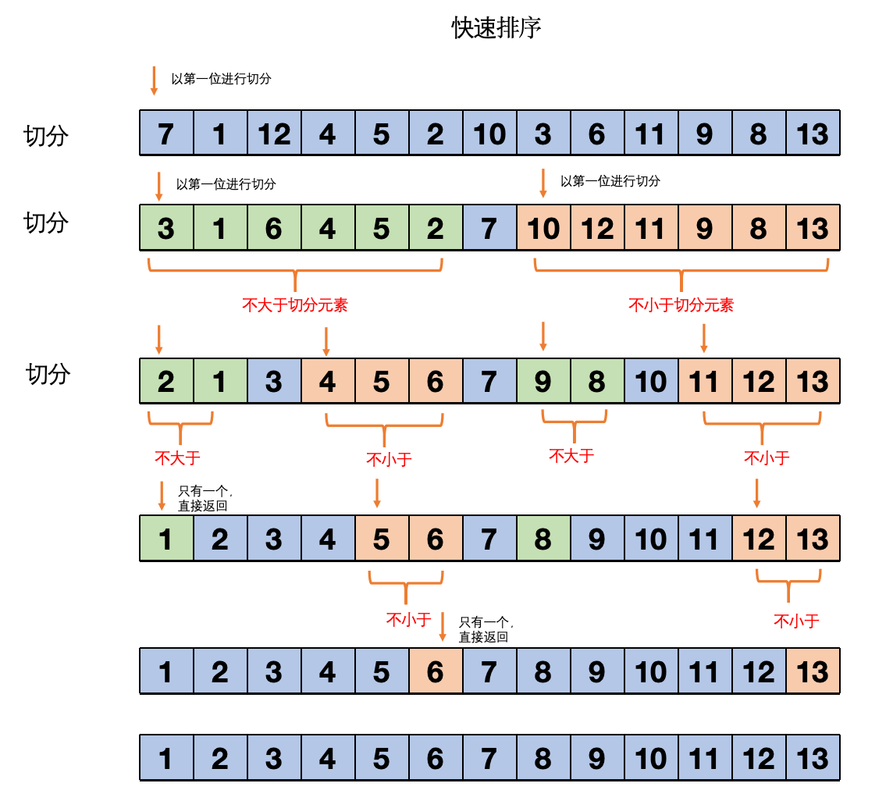
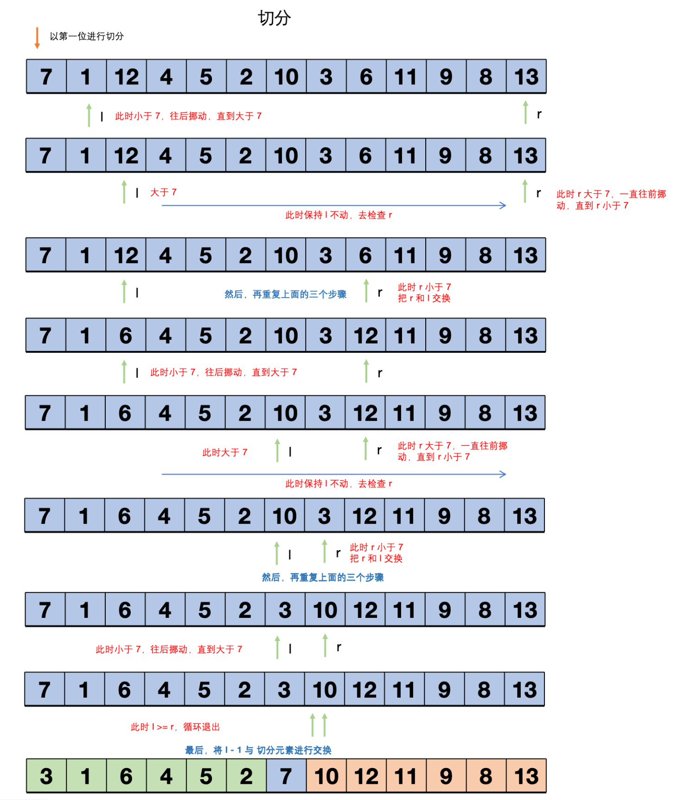

# 快速排序 {#guide}

快速排序，应该是应用得最为广泛的排序算法了。因为它实现简单，而且适用于各种不同的输入数据，切在一般应用中比其它排序算法都要快得多。

它有两大优点

- 原地排序（仅仅需要一个很小的辅助栈）
- 时间复杂度 O(N\*logN)

但它的缺点也很很明显，它非常的 “脆弱”，但经过错误获得的教训也大大地改进了快排。什么意思呢？后面我们会讲到的，先来看看快排吧。

## 基本算法 {#basic}

快排同样是基于分治的思想。

> ps：算法的时间复杂度只要带有 logN，比如 O(logN) O(N \* logN)，那么一定会用到分治的思想，比如二分法，就是分治，时间复杂度为 O(logN)，因为分治是每次都解决大问题的一半，这样计算出来的时间复杂度就是 logN

我们先来回想一个归并排序，归并排序是：将数组分成两个子数组，然后对这两个子数组分别排序，排序后，将这两个有序数组进行一次归并，最终就能得到一个有序的数组了

快排是两个子数组都有序后，数组自然就有序了，我们来看看整个的过程：

<div align='center'>
  
  <p class="image-title">图1：快速排序</p>
</div>

这是切分的过程，每次切分后，切分元素的左边就是不大于它的了，切分元素的右边就是不小于它的了，所以每次切分就相当于确定了一个元素的位置。

然后递归地调用切分来实现数组的排序。

所以接下来我们要看的是如果实现切分，切分是怎么确定一个元素的位置的呢？也就是怎么让切分元素的左边都不大于它，右边都不小于它的呢？来看 ：

<div align='center'>
  
  <p class="image-title">图2：切分确定一个元素的位置</p>
</div>

然后我们来看一下基础的快排代码
:::tip
注意，我说的是基础哟
:::

```js
function exch(arr, i, j) {
  const temp = arr[i];
  arr[i] = arr[j];
  arr[j] = temp;
}

function partition(arr, l, r) {
  // 切分元素
  const k = arr[l];
  let i = l + 1;
  let j = r;

  // 开始走三步骤
  while (1) {
    // 1. 检查左边元素，一直往后挪动，直到元素大于切分元素
    while (i <= j && arr[i] <= k) {
      i++;
    }

    // 2. 检查右边元素，一直往前挪动，直到元素小于切分元素
    while (j >= i && arr[j] >= k) {
      j--;
    }

    // 这里要记得检查一下是否越界了
    if (i >= j) {
      break;
    }

    // 3. 交换 i 和 j
    exch(arr, i, j);
  }

  exch(arr, l, i - 1);
  return i - 1;
}

function sort(arr, l, r) {
  // 递归终止条件
  if (l >= r) {
    return;
  }
  // 进行切分
  const p = partition(arr, l, r);
  // 切分完成后，l ~ p - 1 就是不大于 p 位置元素的了，p + 1 ~ r 就是不小于 p 位置元素的了
  // 然后，对 l ~ p - 1  排序，p + 1 ~ r 也排序，然后整体就有序了
  sort(arr, l, p - 1);
  sort(arr, p + 1, r);
}

function quickSort(arr) {
  sort(arr, 0, arr.length - 1);
}
```

为什么这个是一个基础版本呢？因为快排有一个非常大的缺陷，比如我要排序的数组如下

```js
[1, 2, 3, 4, 5, 6, 7, 8, 9, 10];
```

如果我们每次都选择第一个元素作为切分元素，那么在每一轮切分中，我们都只能将数组分为两部分：一个只包含一个元素（切分元素自身），另一个包含剩余的所有元素。这样，我们需要进行 n 次切分才能完成排序，每次切分都需要遍历剩余的所有元素，所以总的时间复杂度是 O(N^2)。

那怎么避免这样的问题出现呢？很简单，就是将数组在排序之前先随机打乱数组，例如得到

```js
[3, 1, 4, 2, 7, 6, 9, 8, 5, 10];
```

这次，我们每次选择的切分元素都是随机的，所以在每一轮切分中，我们可以期望将数组分为两个大致相等的部分。这样，我们只需要进行 log N 次切分就能完成排序，每次切分仍然需要遍历所有元素，所以总的时间复杂度是 O(N \* log N)。

这就是为什么我们在快速排序之前要随机打乱数组的原因。通过随机打乱，我们可以避免最坏情况的发生，使得快速排序的性能在实践中更加稳定和可预测。

那么实现一个随机打乱的方法即可

```js
function shuffle(arr) {
  const len = arr.length;
  for (let i = 0; i < len; i++) {
    const next = i + Math.floor(Math.random() * (len - i));
    exch(arr, i, next);
  }
}
```

至此，一个标准的快排就诞生了

```js
function exch(arr, i, j) {
  const temp = arr[i];
  arr[i] = arr[j];
  arr[j] = temp;
}

function shuffle(nums) {
  const len = nums.length;
  for (let i = 0; i < len; i++) {
    const next = i + Math.floor(Math.random() * (len - i));
    exch(nums, i, next);
  }
}

function partition(arr, l, r) {
  // 切分元素
  const k = arr[l];
  let i = l + 1;
  let j = r;

  // 开始走三步骤
  while (1) {
    // 1. 检查左边元素，一直往后挪动，直到元素大于切分元素
    while (i <= j && arr[i] <= k) {
      i++;
    }

    // 2. 检查右边元素，一直往前挪动，直到元素小于切分元素
    while (j >= i && arr[j] >= k) {
      j--;
    }

    // 这里要记得检查一下是否越界了
    if (i >= j) {
      break;
    }

    // 3. 交换 i 和 j
    exch(arr, i, j);
  }

  exch(arr, l, i - 1);
  return i - 1;
}

function sort(arr, l, r) {
  // 递归终止条件
  if (l >= r) {
    return;
  }
  // 进行切分
  const p = partition(arr, l, r);
  // 切分完成后，l ~ p - 1 就是不大于 p 位置元素的了，p + 1 ~ r 就是不小于 p 位置元素的了
  // 然后，对 l ~ p - 1  排序，p + 1 ~ r 也排序，然后整体就有序了
  sort(arr, l, p - 1);
  sort(arr, p + 1, r);
}

function quickSort(arr) {
  shuffle(arr);
  sort(arr, 0, arr.length - 1);
}

const arr = [7, 1, 12, 4, 5, 2, 10, 6, 3, 11, 9, 8, 13];
quickSort(arr);
console.log(arr);
```
